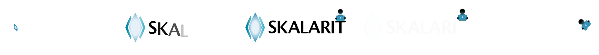
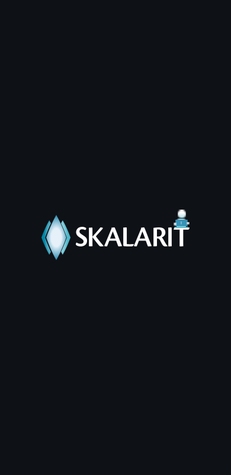

# splash

"Made by Skalarit": the short intro Skalarit AB's apps open with. It is
Skalarit's logo, animated with [gunim](https://github.com/marrasen/gunim),
with a short sting of sound made in code. Any gunim app shows it in a
few lines.


## What it does

The diamond pops in on a spring with a little turn. The wedges open out
from behind it, one to each side, and the glow in the diamond swells
once and settles. The letters rise into place one after another, from
left to right. Just after the T, a little person about a letter high
pops up on top of it, sat at a laptop that glows in the logo's teal,
typing away. At 1.25 seconds the T goes from under them, and the rest
of the logo fades, gone by 1.55 seconds. The person stops typing and
looks down: uh-oh. At 1.58 seconds they fall with a springy
"boioioing", tumbling back, for about 0.6 seconds in plain view. Near
the end of the fall, at 2.13 seconds, the intro tells the app it is
done, and the person and the background fade away over the app's first
screen. It is all gone at 2.33 seconds.



The sound follows the logo, in E major. An E major chord, E4, G#4, B4
and E5 over E3 and B2, starts at the first frame, quietly. It grows
louder and brighter as the logo comes together, is fullest as the logo
settles at 0.66 seconds, and then rings out: a small lift. The low
tones sound mostly through their octaves, so a phone's small speaker
still gives them. Chimes play over the chord: a soft pop rising into
B4 as the diamond lands, a mallet note from the left and one from the
right as the wedges open, two bells as the glow swells, and a light run
of plucks up through the chord as the letters rise. As the person
falls, a boing plays on the frame the fall starts: a twang whose pitch
bounces up and down 15 times a second as it falls from C#5 to E4, for
0.6 seconds. The sound peaks at -11 dBFS, and has all faded by 2.18
seconds, before the intro has gone.

A tap, a click or any key skips the intro. The app hears that it is done
at once, and the intro, the person and the sound fade out in 0.2
seconds. From Done on, the app has the taps and keys, and the last
0.2 seconds of the fade play out. The window hidden in the middle, as a phone's app sent to the background,
skips it too.

The logo keeps its proportions and sits in the middle of any window: a
phone held upright or sideways, a tablet or a desktop window. It is as
large as fits within 64% of the window's width, half its height and 520
logical pixels across. On a phone it keeps clear of the status bar and
the navigation bar.



## Using it

Register the view with the window, mount the app's first screen, then
mount the intro over it. The first screen loads behind the intro
meanwhile. Unmount the intro when it says it is done:

```go
splash.Register(w, mix) // the app's audio.Mixer, or nil for silence

c.Mount(gunim.Root, "home", "home", home)
c.Mount(gunim.Root, "intro", splash.View, splash.Intro{Background: splash.Dark})

for ev := range c.Intents() {
	switch ev.Intent.(type) {
	case splash.Done:
		c.Unmount("intro")
	}
}
```

`splash.Intro` is the intro's state:

- `Background` is the colour behind the logo: `splash.Light`, which is
  white and the default, `splash.Dark`, or the app's own colour, so the
  intro flows into its first screen. The letters are black on a light
  background and white on a dark one.
- `Silent` plays the intro without its sound, for an app with its sound
  turned off. An app with no mixer gets silence too.

`splash.Done` comes once, as the intro starts to fade. `Skipped` says a
tap, a click, a key or the hidden window cut it short. The intro holds
the keyboard while it shows, as a dialog does, and gives it back once
it leaves.

An app that builds its own tree can put a `*splash.Splash` from
`splash.New` in it and set its `OnDone`. `Splash.Hold` stops it at a
moment, for pictures.

## Trying it

`cmd/preview` plays the intro over a plain first screen. A tap, a click
or a key there plays it again.

```sh
go run ./cmd/preview
go run ./cmd/preview -background dark -size 390x800
go run ./cmd/preview -background '#20304a' -loop 1s
go run ./cmd/preview -silent
```

`-shot` holds the intro at the moment `-at` and writes the window to a
PNG file. `-frames` writes the whole intro as PNG files, `-fps` a
second. The pictures here came from them; a GIF is one ffmpeg command
away:

```sh
go run ./cmd/preview -shot intro.png -at 1s
go run ./cmd/preview -frames /tmp/frames -fps 25 -size 840x400
ffmpeg -framerate 25 -i /tmp/frames/frame-%03d.png -vf "crop=840:370:0:30,scale=560:-1,split[a][b];[a]palettegen[p];[b][p]paletteuse" intro.gif
```

On Android, gunim's `gunimapk` builds and starts it:

```sh
go run github.com/marrasen/gunim/tools/gunimapk -run ./cmd/preview
```

## Tests

The tests run the intro on gunim's offscreen window and check every
frame: nothing jumps, nothing pops in or out at once, the logo stays in
the window, and the letters come in from left to right. They play it
through at 60 and 144 frames a second in four window sizes, on light and
dark, and check that 30, 60, 90 and 144 frames a second show the same
moments. They check the little person: sat on the T in every size, in
the letters' colour on light and dark, typing; falling only once the T
has gone, a clear way, within the window; and gone by the end. The
boing plays on the frame the fall starts, wobbles in pitch, and stays
silent with the sound off. They also skip it in the middle, resize the
window in the middle, hide the window in the middle, play it in tiny
windows, play it with the sound off, and check that `Done` comes
exactly once.

```sh
go test ./...
```

## Licence

The code is under the Apache License 2.0, in `LICENSE`. The Skalarit
logo, in `logo/` and in the pictures in `docs/`, is © Skalarit AB, all
rights reserved; see `NOTICE`.
